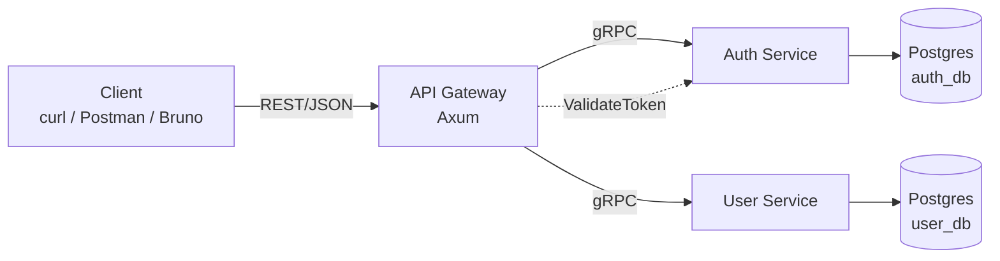
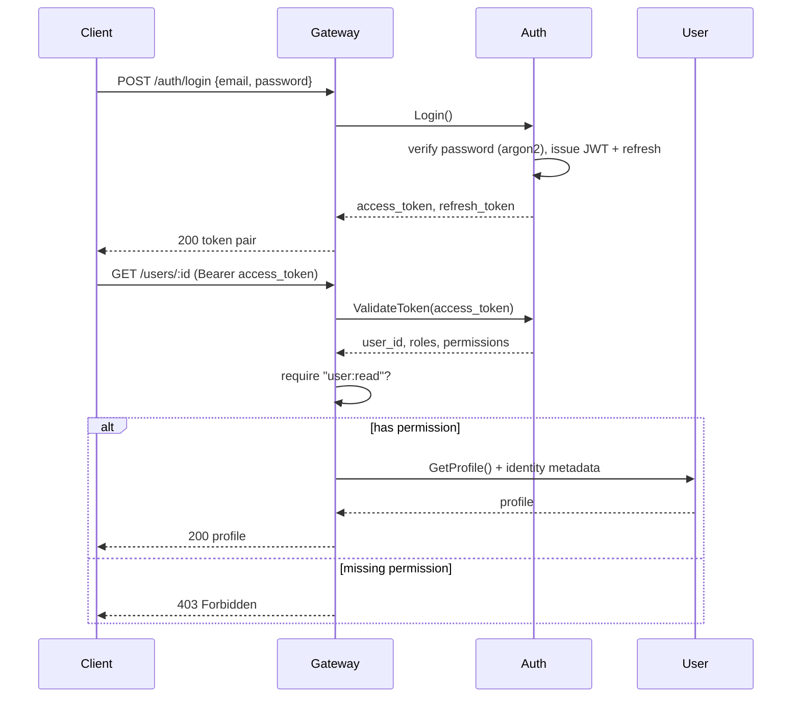
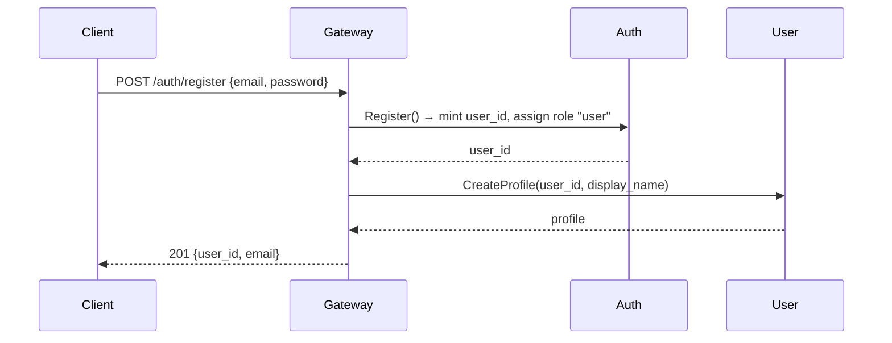

# Architecture — iam-rust

🌐 **English** | [Bahasa Indonesia](../id/architecture.md) · [↑ Docs index](README.md)

## Overview

`iam-rust` is an Identity & Access Management system split into three services:

- **Auth Service** (gRPC) — source of truth for identity, credentials, JWT
  tokens, and all RBAC (roles, permissions, assignments).
- **User Service** (gRPC) — user profiles, keyed by the canonical `user_id`
  minted by Auth.
- **API Gateway** (Axum, REST) — the only public entrypoint. Validates the JWT,
  resolves the caller's permissions, enforces RBAC per route, and translates
  REST → gRPC.

PostgreSQL is the datastore (a logical database per service: `auth_db`,
`user_db`).

## Component diagram

## Responsibilities

| Service | Owns | Key operations |
|---|---|---|
| Auth | `users`, `refresh_tokens`, `roles`, `permissions`, `role_permissions`, `user_roles` | Register, Login, Refresh, Logout, ValidateToken, RBAC management |
| User | `profiles` | CreateProfile, GetProfile, UpdateProfile, DeleteProfile, ListProfiles |
| Gateway | nothing (stateless) | AuthN (JWT), AuthZ (permission check), REST↔gRPC, register orchestration |

The internal services trust the identity the gateway puts in gRPC metadata
(`x-user-id`, `x-user-email`, `x-user-roles`, `x-user-permissions`) because only
the gateway is reachable from outside; the services sit on the internal network.

## Flow: login + authenticated request

## Flow: registration (gateway orchestration)

## Tokens

- **Access token**: short-lived JWT (HS256), carries `sub` (user_id) + `email`.
  Permissions are NOT baked into the token — they are resolved fresh from the DB
  on every `ValidateToken` call, so role changes take effect immediately
  (dynamic RBAC).
- **Refresh token**: long-lived opaque random string. Only its SHA-256 hash is
  stored; it can be revoked (logout) and is rotated on every refresh.

See also: [RBAC model](rbac.md) · [API reference](api-reference.md) ·
[Development](development.md) for the database ERD.
