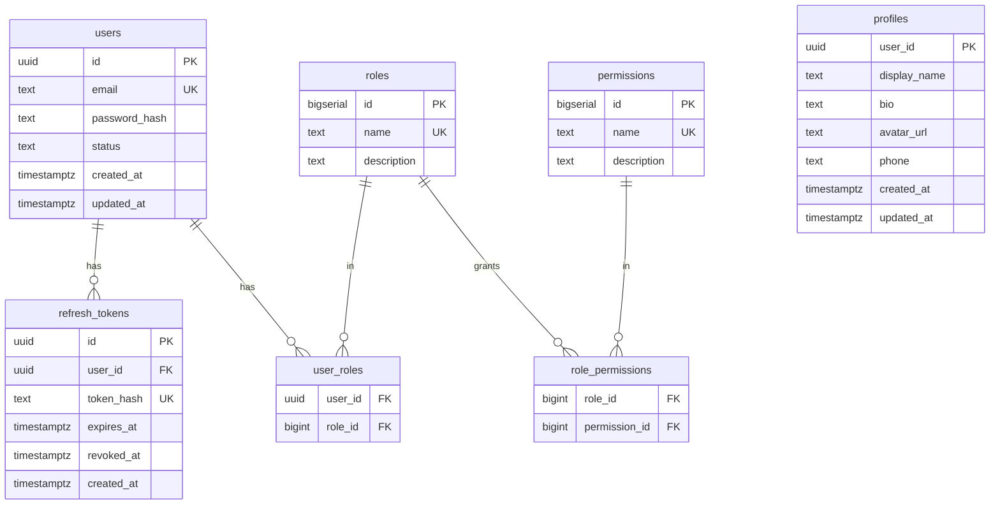

# Development Guide — iam-rust

🌐 **English** | [Bahasa Indonesia](../id/development.md) · [↑ Docs index](README.md)

## Toolchain

- Rust (stable, edition 2021) + Cargo
- `protobuf-compiler` (for tonic-build)
- Docker + Docker Compose

## Common commands

```bash
make build     # cargo build --workspace
make test      # cargo test --workspace
make clippy    # cargo clippy --workspace
make up        # docker compose up --build -d
make smoke     # scripts/smoke.sh http://localhost:8080
make down      # docker compose down -v
```

## Code generation

There is no separate proto/sqlc generation step:

- **gRPC**: proto is generated by `tonic-build` in `crates/proto/build.rs` at
  compile time, from the canonical contracts in `proto/**`.
- **SQL**: DB access uses sqlx **runtime-checked** queries (`query_as` /
  `query_scalar`), so there is no codegen and no live DB needed to compile (the
  Docker build is fully offline).

## Project structure

```
proto/                       canonical gRPC contracts
crates/proto/                tonic-build codegen (build.rs)
crates/common/               shared: config, jwt, password (argon2), telemetry
crates/auth-service/         Auth gRPC service (grpc.rs, repo.rs, migrations)
crates/user-service/         User gRPC service
crates/gateway/              Axum REST gateway (router.rs, middleware.rs, clients.rs, error.rs)
deploy/                      docker-compose, .env, postgres-init, k8s
scripts/smoke.sh             end-to-end test
```

Request path: `crates/gateway/src/router.rs` → `middleware.rs` (AuthN + AuthZ via
Identity extractor) → tonic client (`clients.rs`) → service `grpc.rs` →
`repo.rs` (sqlx) → Postgres.

## Testing

`make test` runs unit tests (e.g. JWT sign/verify/expiry in `crates/common`). The
end-to-end behavior (auth flow, refresh rotation, revocation, dynamic RBAC) is
covered by `scripts/smoke.sh` against a running stack.

## Database schema (ERD)



`users`, `refresh_tokens`, `roles`, `permissions`, `role_permissions`,
`user_roles` live in **auth_db**; `profiles` lives in **user_db** (keyed by the
`user_id` minted by Auth — no cross-database FK).

## Conventions

- Conventional Commits (see [CONTRIBUTING](../../CONTRIBUTING.md)).
- Run `cargo fmt` and `cargo clippy` before committing.
- Keep handlers thin; put SQL in `repo.rs`.
- Map domain errors to tonic `Status` codes; the gateway maps those to HTTP
  statuses (`crates/gateway/src/error.rs`).
- Update docs in **both** `docs/en` and `docs/id` when behavior changes.
