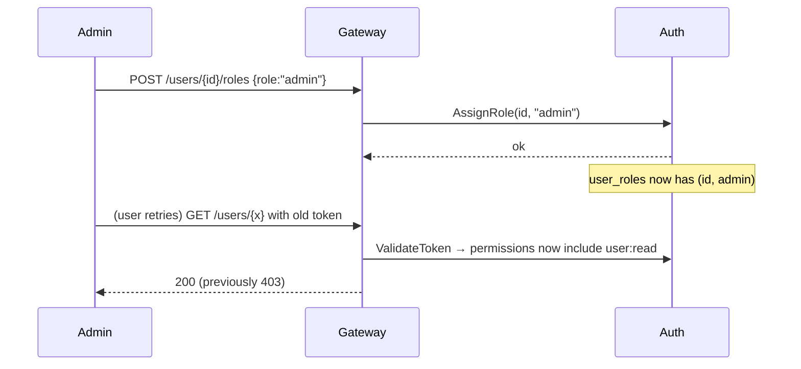

# RBAC Model — iam-rust

🌐 **English** | [Bahasa Indonesia](../id/rbac.md) · [↑ Docs index](README.md)

## Model

Access control is **role → permission** (granular). A user has one or more
**roles**; each role grants a set of **permissions**; the gateway authorizes a
request by checking whether the caller holds the **permission** a route requires.

```
user ──(user_roles)──> role ──(role_permissions)──> permission
```

Permissions are **defined by the application** (each maps to a real check in the
gateway, e.g. `user:read`). They are seeded, not created at runtime — creating a
permission no code checks would be meaningless. Roles, on the other hand, are
fully manageable at runtime.

## Seeded roles

| Role | Permissions |
|---|---|
| `admin` | `user:read`, `user:write`, `user:delete`, `role:read`, `role:assign`, `role:write`, `profile:read`, `profile:write` |
| `user` | `profile:read`, `profile:write` |

A newly registered user gets `user`. A **bootstrap admin** is created on first
boot (`BOOTSTRAP_ADMIN_EMAIL` / `BOOTSTRAP_ADMIN_PASSWORD`, default
`admin@iam.local` / `admin12345`).

## Permissions

| Permission | Meaning |
|---|---|
| `user:read` | Read any user / list users |
| `user:write` | Modify any user |
| `user:delete` | Delete any user |
| `role:read` | List roles & permissions |
| `role:assign` | Assign/revoke roles to/from users |
| `role:write` | Create/update/delete roles and grant/revoke their permissions |
| `profile:read` | Read own profile |
| `profile:write` | Modify own profile |

## Dynamic RBAC

The access token carries only identity (`sub`, `email`) — **not** permissions.
On every request the gateway calls `Auth.ValidateToken`, which reads the caller's
roles & permissions **from the database**. So when an admin assigns or revokes a
role, the change takes effect on the user's **next request** — no re-login
needed.



## Managing access

- **User ↔ role**: `POST /users/:id/roles` (assign), `DELETE /users/:id/roles/:role` (revoke) — needs `role:assign`.
- **Role lifecycle**: `POST /roles`, `PATCH /roles/:name`, `DELETE /roles/:name` — needs `role:write`. Built-in `admin`/`user` cannot be deleted.
- **Role ↔ permission**: `POST /roles/:name/permissions` (grant), `DELETE /roles/:name/permissions/:perm` (revoke) — needs `role:write`.
- **Introspection**: `GET /me` (your roles/permissions), `GET /roles`, `GET /permissions`.

See [API reference](api-reference.md) for request/response details.
---

## Defense in depth

Authorization is enforced in more than one place:

- The **gateway** checks the required permission for every route.
- The internal **services independently re-check** the permission from the
  gateway-supplied identity (so a bug or bypass at the gateway is not enough).
- The gateway authenticates to the services with a shared
  **`INTERNAL_SERVICE_TOKEN`**; services reject any caller that is not the gateway.
- Editing another user's profile requires **`user:write`** (admin); `profile:write`
  only covers your **own** profile.
- **Logout** revokes the access token immediately (jti denylist), not just the
  refresh token.
