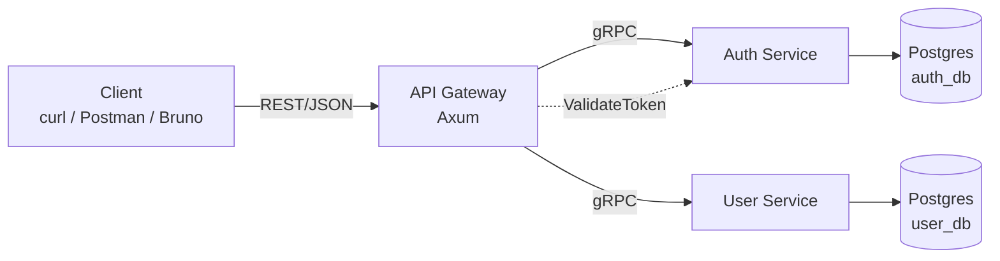
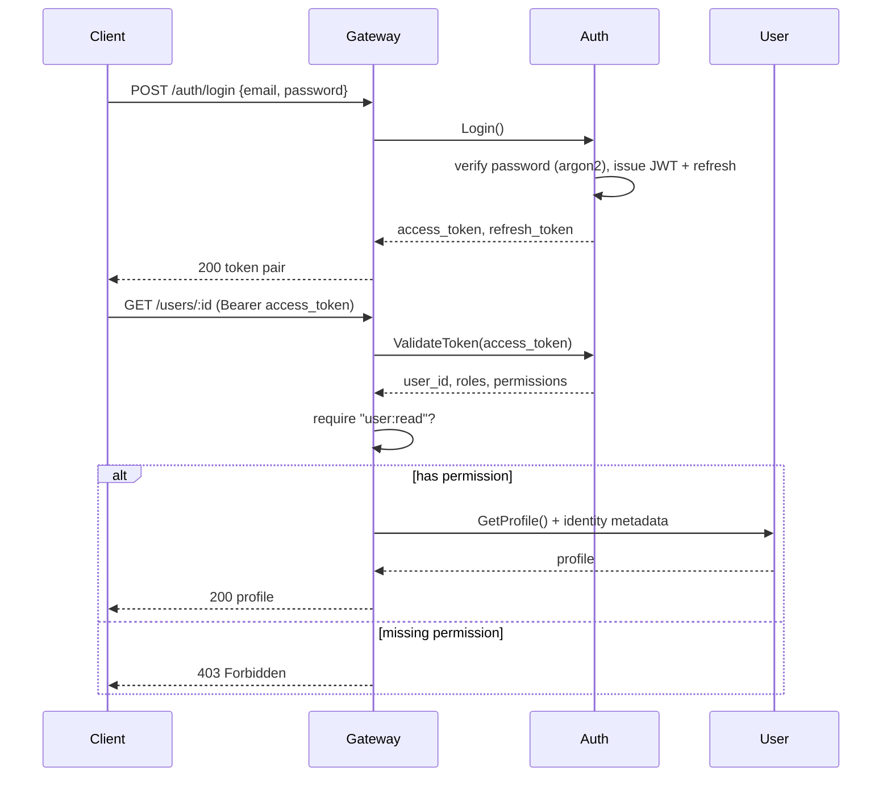
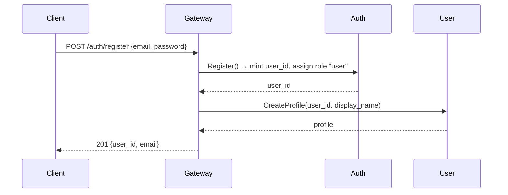

# Arsitektur — iam-rust

🌐 [English](../en/architecture.md) | **Bahasa Indonesia** · [↑ Indeks dokumentasi](README.md)

## Ikhtisar

`iam-rust` adalah sistem Identity & Access Management yang dibagi menjadi tiga layanan:

- **Auth Service** (gRPC) — sumber kebenaran untuk identitas, kredensial, token
  JWT, dan seluruh RBAC (role, permission, penetapan).
- **User Service** (gRPC) — profil user, dikunci dengan `user_id` kanonik yang
  dibuat oleh Auth.
- **API Gateway** (Axum, REST) — satu-satunya entrypoint publik. Memvalidasi JWT,
  menyelesaikan permission pemanggil, menegakkan RBAC per route, dan
  menerjemahkan REST → gRPC.

PostgreSQL adalah datastore-nya (satu database logis per layanan: `auth_db`,
`user_db`).

## Diagram komponen

## Tanggung jawab

| Layanan | Memiliki | Operasi utama |
|---|---|---|
| Auth | `users`, `refresh_tokens`, `roles`, `permissions`, `role_permissions`, `user_roles` | Register, Login, Refresh, Logout, ValidateToken, manajemen RBAC |
| User | `profiles` | CreateProfile, GetProfile, UpdateProfile, DeleteProfile, ListProfiles |
| Gateway | tidak ada (stateless) | AuthN (JWT), AuthZ (pengecekan permission), REST↔gRPC, orkestrasi registrasi |

Layanan internal mempercayai identitas yang ditaruh gateway di metadata gRPC
(`x-user-id`, `x-user-email`, `x-user-roles`, `x-user-permissions`) karena hanya
gateway yang dapat dijangkau dari luar; layanan-layanan tersebut berada di
jaringan internal.

## Alur: login + request terautentikasi

## Alur: registrasi (orkestrasi gateway)

## Token

- **Access token**: JWT berumur pendek (HS256), membawa `sub` (user_id) + `email`.
  Permission TIDAK ditanamkan ke dalam token — keduanya diselesaikan secara segar
  dari DB pada setiap pemanggilan `ValidateToken`, sehingga perubahan role berlaku
  segera (RBAC dinamis).
- **Refresh token**: string acak opaque berumur panjang. Hanya hash SHA-256-nya
  yang disimpan; token dapat dicabut (logout) dan dirotasi pada setiap refresh.

Lihat juga: [model RBAC](rbac.md) · [referensi API](api-reference.md) ·
[Pengembangan](development.md) untuk ERD database.
