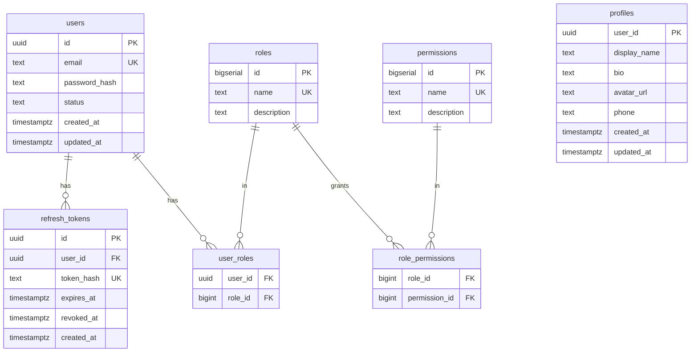

# Panduan Pengembangan — iam-rust

🌐 [English](../en/development.md) | **Bahasa Indonesia** · [↑ Indeks dokumentasi](README.md)

## Toolchain

- Rust (stable, edition 2021) + Cargo
- `protobuf-compiler` (untuk tonic-build)
- Docker + Docker Compose

## Perintah umum

```bash
make build     # cargo build --workspace
make test      # cargo test --workspace
make clippy    # cargo clippy --workspace
make up        # docker compose up --build -d
make smoke     # scripts/smoke.sh http://localhost:8080
make down      # docker compose down -v
```

## Pembuatan kode (code generation)

Tidak ada langkah pembuatan proto/sqlc terpisah:

- **gRPC**: proto dibuat oleh `tonic-build` di `crates/proto/build.rs` saat waktu
  kompilasi, dari kontrak kanonik di `proto/**`.
- **SQL**: akses DB menggunakan query sqlx yang **diperiksa saat runtime**
  (`query_as` / `query_scalar`), sehingga tidak ada codegen dan tidak perlu DB
  yang hidup untuk mengompilasi (build Docker sepenuhnya offline).

## Struktur proyek

```
proto/                       canonical gRPC contracts
crates/proto/                tonic-build codegen (build.rs)
crates/common/               shared: config, jwt, password (argon2), telemetry
crates/auth-service/         Auth gRPC service (grpc.rs, repo.rs, migrations)
crates/user-service/         User gRPC service
crates/gateway/              Axum REST gateway (router.rs, middleware.rs, clients.rs, error.rs)
deploy/                      docker-compose, .env, postgres-init, k8s
scripts/smoke.sh             end-to-end test
```

Jalur request: `crates/gateway/src/router.rs` → `middleware.rs` (AuthN + AuthZ
melalui ekstraktor Identity) → klien tonic (`clients.rs`) → layanan `grpc.rs` →
`repo.rs` (sqlx) → Postgres.

## Pengujian

`make test` menjalankan unit test (mis. JWT sign/verify/expiry di
`crates/common`). Perilaku end-to-end (alur auth, rotasi refresh, pencabutan,
RBAC dinamis) dicakup oleh `scripts/smoke.sh` terhadap stack yang sedang berjalan.

## Skema database (ERD)



`users`, `refresh_tokens`, `roles`, `permissions`, `role_permissions`,
`user_roles` berada di **auth_db**; `profiles` berada di **user_db** (dikunci
dengan `user_id` yang dibuat oleh Auth — tanpa FK lintas database).

## Konvensi

- Conventional Commits (lihat [CONTRIBUTING](../../CONTRIBUTING.md)).
- Jalankan `cargo fmt` dan `cargo clippy` sebelum commit.
- Jaga handler tetap tipis; letakkan SQL di `repo.rs`.
- Petakan error domain ke kode tonic `Status`; gateway memetakannya ke status
  HTTP (`crates/gateway/src/error.rs`).
- Perbarui dokumen di **kedua** `docs/en` dan `docs/id` ketika perilaku berubah.
