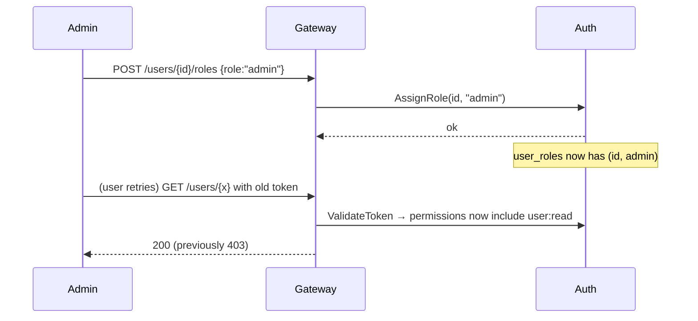

# Model RBAC — iam-rust

🌐 [English](../en/rbac.md) | **Bahasa Indonesia** · [↑ Indeks dokumentasi](README.md)

## Model

Kontrol akses bersifat **role → permission** (granular). Seorang user memiliki
satu atau lebih **role**; setiap role memberikan sekumpulan **permission**;
gateway mengotorisasi sebuah request dengan memeriksa apakah pemanggil memiliki
**permission** yang dibutuhkan sebuah route.

```
user ──(user_roles)──> role ──(role_permissions)──> permission
```

Permission **didefinisikan oleh aplikasi** (masing-masing dipetakan ke
pengecekan nyata di gateway, mis. `user:read`). Permission di-seed, bukan dibuat
saat runtime — membuat permission yang tidak diperiksa kode mana pun tidak akan
ada artinya. Sebaliknya, role sepenuhnya dapat dikelola saat runtime.

## Role yang di-seed

| Role | Permission |
|---|---|
| `admin` | `user:read`, `user:write`, `user:delete`, `role:read`, `role:assign`, `role:write`, `profile:read`, `profile:write` |
| `user` | `profile:read`, `profile:write` |

User yang baru terdaftar mendapatkan `user`. Sebuah **admin bootstrap** dibuat
saat boot pertama (`BOOTSTRAP_ADMIN_EMAIL` / `BOOTSTRAP_ADMIN_PASSWORD`, default
`admin@iam.local` / `admin12345`).

## Permission

| Permission | Arti |
|---|---|
| `user:read` | Membaca user mana pun / mendaftar user |
| `user:write` | Memodifikasi user mana pun |
| `user:delete` | Menghapus user mana pun |
| `role:read` | Mendaftar role & permission |
| `role:assign` | Menetapkan/mencabut role ke/dari user |
| `role:write` | Membuat/memperbarui/menghapus role serta memberikan/mencabut permission-nya |
| `profile:read` | Membaca profil sendiri |
| `profile:write` | Memodifikasi profil sendiri |

## RBAC dinamis

Access token hanya membawa identitas (`sub`, `email`) — **bukan** permission.
Pada setiap request gateway memanggil `Auth.ValidateToken`, yang membaca role &
permission pemanggil **dari database**. Jadi ketika seorang admin menetapkan atau
mencabut sebuah role, perubahan tersebut berlaku pada **request berikutnya** dari
user — tanpa perlu login ulang.



## Mengelola akses

- **User ↔ role**: `POST /users/:id/roles` (assign), `DELETE /users/:id/roles/:role` (revoke) — membutuhkan `role:assign`.
- **Siklus hidup role**: `POST /roles`, `PATCH /roles/:name`, `DELETE /roles/:name` — membutuhkan `role:write`. Role bawaan `admin`/`user` tidak dapat dihapus.
- **Role ↔ permission**: `POST /roles/:name/permissions` (grant), `DELETE /roles/:name/permissions/:perm` (revoke) — membutuhkan `role:write`.
- **Introspeksi**: `GET /me` (role/permission Anda), `GET /roles`, `GET /permissions`.

Lihat [referensi API](api-reference.md) untuk detail request/response.
---

## Pertahanan berlapis

Otorisasi ditegakkan di lebih dari satu tempat:

- **Gateway** mengecek permission yang dibutuhkan untuk setiap route.
- **Service internal mengecek ulang** permission dari identitas yang dikirim
  gateway (sehingga bug/bypass di gateway saja tidak cukup).
- Gateway mengautentikasi ke service dengan **`INTERNAL_SERVICE_TOKEN`** bersama;
  service menolak pemanggil yang bukan gateway.
- Mengubah profil user lain butuh **`user:write`** (admin); `profile:write` hanya
  untuk profil **sendiri**.
- **Logout** mencabut access token seketika (denylist jti), bukan hanya refresh token.
